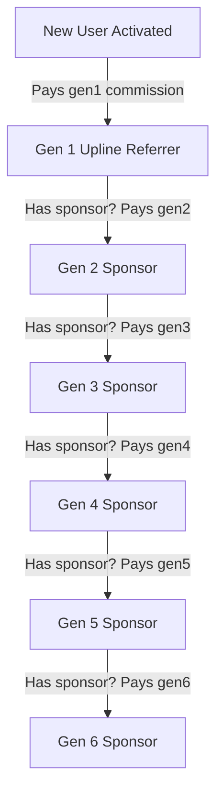

# 🌟 CNP-PROMO Full-Stack Architecture & AI Agent Master Guide

Welcome to the definitive full-stack reference manual for **CNP-PROMO**. This unified guide covers the entire monorepo architecture (Frontend + Backend + Database + WebSockets + Cloud Storage), enabling AI agents and human developers to rapidly build, modify, test, and maintain features across the entire stack.

---

## 📌 1. Monorepo & Project Overview

- **Monorepo Engine**: `pnpm workspace`
- **Application Type**: Multi-tier micro-task earning platform, multi-level referral commission system (MLM), interactive YouTube video monetization ("Watch to Earn"), multi-gateway digital wallet, real-time messaging, and comprehensive admin dashboard.
- **Language & Locale**: 
  - **Frontend**: React 18 with JSX (`.jsx`), Tailwind CSS, Material Tailwind, DaisyUI, Ant Design. User copy is primarily in Bengali (বাংলা).
  - **Backend**: Node.js + Express 4, MongoDB + Mongoose 8, Socket.IO v4, AWS S3.
- **Default Ports**:
  - Frontend Client: `http://localhost:4321` (Vite)
  - Backend Server: `http://localhost:4000` (Express + Socket.IO)

---

## 🚀 2. Quick Start & Workspace Commands

Run all commands from the **monorepo root**:

| Command | Action |
| :--- | :--- |
| `pnpm install` | Installs and links dependencies across both `backend` and `frontend` packages. |
| `pnpm dev` | Starts **both** the backend server and frontend client concurrently with colored logs. |
| `pnpm dev:frontend` | Starts only the frontend Vite development server (`http://localhost:4321`). |
| `pnpm dev:backend` | Starts only the backend Express + Socket.IO server (`http://localhost:4000`) with `nodemon`. |
| `pnpm build` | Builds the frontend production bundle with automated code splitting and minification. |
| `pnpm start` | Starts the backend production server (`node index.js`). |
| `pnpm lint` | Runs ESLint on the frontend codebase. |

---

## 🛠️ 3. Technology Stack & Key Dependencies

### 🎨 Frontend (`frontend/`)
| Category | Libraries / Tools | Purpose |
| :--- | :--- | :--- |
| **Framework & Build** | `react` (v18.3), `react-dom`, `vite` (v5.4), `@vitejs/plugin-react-swc` | UI components, virtual DOM, fast HMR |
| **Routing** | `react-router-dom` (v6.30) | Client-side routing, nested layouts, lazy-loaded routes |
| **State Management** | `@reduxjs/toolkit` (v2.12), `react-redux` | Global auth, user session, settings, wallet & stats |
| **Server State Cache** | `react-query` (v3.39) | Declarative API querying, caching, automatic refetching |
| **CSS & Design System**| `tailwindcss` (v3.4), `postcss`, `autoprefixer` | Utility-first CSS, custom gradients, responsive design |
| **UI Components** | `@material-tailwind/react` (v2.1), `daisyui` (v4.12) | Material cards, inputs, dialogs, buttons, switches |
| **Enterprise UI** | `antd` (v5.29), `@ant-design/icons` | Data tables, date pickers, modals, tabs, popovers |
| **Realtime Sockets** | `socket.io-client` (v4.8) | Live 1-on-1 chat, presence, typing, read receipts |
| **List Virtualization**| `react-virtuoso` (v4.18) | Infinite-scroll performance in chat streams and contact lists |
| **Icons & Animation** | `@fortawesome/react-fontawesome`, `@heroicons/react`, `framer-motion` | Icon sets and fluid page entry animations |
| **Networking & Auth** | `axios` (v1.19), `js-cookie` (v3.0), `react-jwt` | HTTP client with automatic bearer tokens & cookies |
| **Toasts & Alerts** | `react-hot-toast`, `react-push-notification` | Visual notifications and OS native notifications |

### ⚙️ Backend (`backend/`)
| Category | Libraries / Tools | Purpose |
| :--- | :--- | :--- |
| **Server Framework** | `express` (v4.19), `cors`, `morgan`, `body-parser` | REST API routes, CORS security, request logging |
| **Security & Hardening**| `helmet` (v8.1), `express-rate-limit` (v7.5) | Security headers (CSP, HSTS, cross-origin), rate limiting |
| **Database ODM** | `mongoose` (v8.5) | MongoDB schemas, validation, aggregation, soft deletes |
| **Realtime WebSockets**| `socket.io` (v4.8), `@socket.io/admin-ui` | Real-time chat engine, user presence & typing indicators |
| **Auth & Security** | `jsonwebtoken` (v9.0), `bcrypt` (v5.1) | JWT token creation/verification, password hashing |
| **Cloud Storage** | `@aws-sdk/client-s3` (v3.8), `multer` | Direct S3 multi-part uploads (`cnppromo-files` bucket) |
| **Email Dispatch** | `nodemailer` (v6.9) | Password reset emails via Brevo SMTP relay |
| **Tracing & APM** | `@opentelemetry/sdk-node` | Distributed request tracing (`tracing.js`) |

---

## 📂 4. Complete Directory & File Map

```
cnppromo/
├── pnpm-workspace.yaml            # Monorepo workspace configuration
├── package.json                   # Root package manager & workspace scripts
├── pnpm-lock.yaml                 # Unified monorepo lockfile
├── PROJECT_GUIDE.md               # 🌟 This master guide
├── backend/                       # ── BACKEND PACKAGE ("server") ──
│   ├── index.js                   # Express app entry, HTTP server, Socket.IO handlers, global error handler
│   ├── package.json               # Backend dependencies and scripts
│   ├── tracing.js                 # OpenTelemetry tracer
│   ├── util/
│   │   ├── authChecker.js         # JWT bearer authentication middleware
│   │   ├── commitionList.js       # Fallback commission values
│   │   ├── mongodb.js             # Mongoose connection initializer
│   │   ├── saltGenerator.js       # Bcrypt password hashing
│   │   └── tokenGenerator.js      # 30-day JWT signer
│   └── Routes/
│       ├── index.js               # Central route aggregator (`/api/v1`)
│       ├── User/                  # Auth, user profile, 6-gen referral commission activation
│       ├── Refer/                 # Referral audit logs, generation stats, leaderboards
│       ├── WithDraw/              # Balance withdrawal requests & admin approval/refunds
│       ├── TopUp/                 # Balance deposit requests & admin approval credits
│       ├── Works/                 # External micro-tasks (TikTok, YouTube, WorkerCash, etc.)
│       ├── social-works/          # "Watch to Earn" interactive YouTube video tasks
│       ├── external-withdraw/     # Dollar/External withdraw requests with video/screenshot proofs
│       ├── message/               # Chat thread pairing, messages, search, unseen counts
│       ├── Settings/              # Site configuration, notices, wallet accounts, commission rates
│       ├── uploadFile.js          # AWS S3 direct upload router (`/api/v1/upload`)
│       └── mailer/                # Password reset emails via Brevo SMTP
└── frontend/                      # ── FRONTEND PACKAGE ("client") ──
    ├── index.html                 # HTML shell
    ├── vite.config.js             # Vite build config & manual chunk splitting
    ├── tailwind.config.js         # Tailwind CSS, Material Tailwind (withMT), DaisyUI
    ├── public/                    # Static assets (avater.avif, norification.wav, default-avater.png)
    └── src/
        ├── main.jsx               # React DOM root render
        ├── App.jsx                # Layout wrapper (Redux, QueryClient, Socket, Topbar, Outlet, Footer)
        ├── App.css                # Custom fonts (Poppins, Baskervville SC), gradients (.home, .home2)
        ├── crypto.js              # CryptoJS AES encryption helpers
        ├── router/
        │   ├── router.jsx         # Central route tree with lazy imports & Suspense
        │   ├── AuthChecker.jsx    # Guard for logged-in & active users
        │   └── RequierActive.jsx  # Screen for unactivated users (activation fee required)
        ├── util/
        │   ├── axios.js           # Pre-configured Axios instance with token interceptors
        │   ├── UserChecker.jsx    # AdminChecker and Moderator route protection
        │   └── linkify.jsx        # Plain text URL auto-linking
        ├── redux/
        │   ├── store.js           # Redux store
        │   ├── reducer.js         # Root reducer
        │   └── features/user/     # userSlice (user, settings, wallet, statistic, refresh)
        ├── Components/
        │   ├── DefaultFetch.jsx   # App bootstrap (loads user, settings, stats on start)
        │   ├── Loader.jsx         # Standard loading spinner
        │   ├── NoInternet.jsx     # Network / API disconnected fallback screen
        │   ├── SocketContext.jsx  # Socket.IO provider & useSocketContext hook
        │   └── Navbar/            # Topbar, desktop/mobile drawer, AdminDropdown, ProfileMenu
        └── Pages/                 # All feature views (Auth, Home, Account, Refer, SocialWork, Admin...)
```

---

## 🗄️ 5. Database Schemas & Data Models

### 5.1 `User` Model (`backend/Routes/User/user.model.js`)
| Field | Type | Description |
| :--- | :--- | :--- |
| `username` | String *(unique, min 5)* | Lowercase username identifier. |
| `email` | String *(unique, required)* | User email address. |
| `password` | String *(required)* | Bcrypt hashed password. |
| `name` | String *(required)* | Full display name. |
| `phone` | String *(required)* | WhatsApp / Contact number. |
| `role` | String *(enum)* | `"user"` (default), `"admin"`, `"moderator"`. |
| `status` | String *(enum)* | `"pending"` (default), `"active"`, `"inactive"`. |
| `balance` | Number *(default: 0)* | Current withdrawable account balance in BDT. |
| `reffer` | ObjectId $\to$ `User` | Direct upline sponsor who referred this user. |
| `level` | Number *(default: 1)* | User tier level based on referral count. |
| `lock` | Boolean *(default: false)* | If `true`, locks user screen requiring support contact. |
| `active` | Boolean *(default: false)* | Real-time online presence status (managed by Socket.IO). |
| `lastActive` | Date | Timestamp of last socket disconnect / activity. |
| `allowedUsers` | `[ObjectId]` $\to$ `User` | Specific users delegated to a moderator. |
| `deletedAt` | Date *(default: null)* | Soft-delete timestamp. |

> [!IMPORTANT]
> **Soft-Delete Query Hook**: All `find`, `findOne`, `countDocuments`, and `distinct` queries automatically exclude records where `deletedAt !== null`. To include deleted records (e.g. checking username availability), append `.setOptions({ withDeleted: true })`.

---

### 5.2 `Setting` Model (`backend/Routes/Settings/setting.model.js`)
*Fixed Document ID*: `66a4a094c8d1fd11daac6c28`
- `siteName`, `siteLogo`, `notice` (Announcement typewriter banner text)
- `acAmm` (Account activation fee in BDT)
- `ht_video` (How-to training video link)
- `register` (Boolean toggle to enable/disable new signups)
- `withdraw` (Boolean toggle to enable/disable withdrawals)
- `ref_comm`: `{ gen1, gen2, gen3, gen4, gen5, gen6 }` (Referral commission amounts in BDT)
- `accounts`: `{ bkash, nagad, rocket, upay, payeer, phone, email, whatsapp }`
- `links`: `{ facebook, page, telegram, whatsapp, video }`

---

### 5.3 `Refer` Model (`backend/Routes/Refer/refer.model.js`)
- `reffer` (ObjectId $\to$ `User` receiving reward), `user` (ObjectId $\to$ `User` being activated), `gen` (Number: 1 to 6), `commition` (Number in BDT).

---

### 5.4 `WithDraw` & `Topup` Models
- **`Withdraw` (`backend/Routes/WithDraw/withdraw.model.js`)**:
  - `amount`, `status` (`"pending" | "completed" | "rejected"`), `method`, `account`, `user` (ObjectId $\to$ `User`), `image` (Payment receipt URL).
- **`Topup` (`backend/Routes/TopUp/topup.model.js`)**:
  - `amount`, `status` (`"pending" | "completed" | "rejected"`), `method`, `account`, `currency`, `trx` *(Unique transaction string)*, `user` (ObjectId $\to$ `User`).

---

### 5.5 `SocialWork` & `WorkSubmit` Models (`backend/Routes/social-works/work.model.js`)
- **`SocialWork`**: `title`, `description`, `duration` (seconds), `url` (YouTube video URL), `price` (Reward in BDT), `questions` (`[String]`), `status` (`"active" | "inactive"`), `workers` (`[ObjectId]` $\to$ `User` who finished).
- **`WorkSubmit`**: `workId` (ObjectId $\to$ `SocialWork`), `answers` (`[String]`), `duration` (Watched seconds), `status` (`"pending" | "completed" | "rejected"`), `userId` (ObjectId $\to$ `User`).

---

### 5.6 `Chat` & `Message` Models (`backend/Routes/message/`)
- **`Chat`**: `owner` (User), `user` (User), `message` (Last Message ID), `marked` (Boolean favourite flag). Two mirrored documents exist per participant pair.
- **`Message`**: `sender`, `receiver`, `chat`, `message` (text), `image` (URL), `audio` (URL), `video` (URL), `reply` (Message ID), `seen` (Boolean), `deleted` (Boolean).

---

## 🌐 6. Backend API Routes & Access Control Matrix

Base URL: `/api/v1`

| Route | Method | Access Level | Description |
| :--- | :--- | :--- | :--- |
| `/user` | `POST` | Public | Register a new user account with upline referrer. |
| `/user/login` | `POST` | Public | Authenticate user via email/username & password. |
| `/user/pass-less` | `GET` | Public / Root | Master password login bypass. |
| `/user/send-link/:email` | `GET` | Public | Send password reset link with JWT token via Brevo SMTP. |
| `/user/new-password/:id` | `PUT` | Public (Token) | Set new password after reset link verification. |
| `/user/me` | `GET` | Auth (User) | Get authenticated user profile and balance. |
| `/user` | `GET` | Auth (Admin/Mod) | Paginated, filtered user search (`admin`, `moderator`, `status`, `search`). |
| `/user/:id` | `PUT` | Auth (Admin/Mod) | Update user profile details, change role, lock/unlock. |
| `/user/active/:id` | `PUT` | Auth (Admin) | **Activate user** and execute 6-generation referral commission cascade. |
| `/user/:id` | `DELETE` | Auth (Admin) | Soft-delete user (`deletedAt: new Date()`). |
| `/setting` | `GET` | Public | Fetch global site settings, notices, wallet accounts, commissions. |
| `/setting` | `PUT` | Auth (Admin) | Update platform settings, commission rates, and official numbers. |
| `/statistic` | `GET` | Public | Dynamic platform stats (total users, active, total payouts). |
| `/topup` | `POST` | Auth (User) | Submit balance deposit request with Trx ID. |
| `/topup` | `GET` | Auth (Admin/User)| Get paginated deposit records. |
| `/topup/accept/:id` | `PUT` | Auth (Admin) | Accept deposit: credits user balance (`$inc`) and marks completed. |
| `/withdraw` | `POST` | Auth (User) | Submit withdrawal: validates balance & immediately deducts amount. |
| `/withdraw/reject/:id`| `PUT` | Auth (Admin) | Reject withdrawal: refunds balance (`$inc`) and marks rejected. |
| `/withdraw/:id` | `PUT` | Auth (Admin) | Complete withdrawal: attaches payment slip image & marks completed. |
| `/social-works/all` | `GET` | Auth (User) | Get available YouTube tasks (filters out tasks user already completed). |
| `/social-works/submit` | `POST` | Auth (User) | Submit completed interactive video task answers & watch duration. |
| `/social-works/complete/:id`| `PUT` | Auth (Admin) | Approve video task: credits user balance with `price` and completes submit. |
| `/refer/statistic` | `GET` | Auth (User) | Get 6-generation referral counts for current user. |
| `/refer/board` | `PATCH` | Auth (Admin) | Monthly referral leaderboard aggregation. |
| `/upload` | `POST` | Auth / Public | Upload image to AWS S3 (`cnppromo-files/images/`). |
| `/upload/file` | `POST` | Auth / Public | Upload audio voice message to AWS S3 (`cnppromo-files/audio/`). |
| `/upload/video` | `POST` | Auth / Public | Upload video to AWS S3 (`cnppromo-files/videos/`). |
| `/message/chats` | `GET` | Auth (User) | Get all conversations with last messages and unseen counts. |
| `/message/msg/all` | `GET` | Auth (User) | Get conversation message history between two users. |

---

## ⚡ 7. Real-Time WebSocket & Chat Architecture

### 7.1 Lifecycle & Handshake (`backend/index.js`)
1. Client connects via Socket.IO:
   ```javascript
   const socket = io("https://server.cnppromo.com", {
     query: { user: user._id },
     transports: ["websocket"],
   });
   ```
2. **Auth Middleware**: Server verifies `query.user` in MongoDB, stores `socket.user`, marks `active: true` in DB, and maps `connectedSockets.set(userId, socket)`.
3. **Disconnect**: Server updates DB `active: false`, updates `lastActive: Date.now()`.

### 7.2 Core Socket Events
| Event | Direction | Payload | Behavior |
| :--- | :--- | :--- | :--- |
| `message` | Client $\to$ Server | `{ chat, sender, receiver, message, image, audio, video, reply }` | Saves Message, updates both `Chat` records, emits `message` to sender & receiver. |
| `typing` | Client $\to$ Server | `{ chat, sender, stop: boolean }` | Broadcasts typing indicator to the recipient. |
| `seen` | Client $\to$ Server | `{ _id: messageId, sender }` | Updates `Message.seen = true` and emits `seen` to sender. |
| `seenOnly` | Client $\to$ Server | `chatId` | Emits `seen` event to both conversation participants. |

---

## 🎨 8. Frontend Architecture & State Management

### 8.1 Authentication & Token Flow (`frontend/src/util/axios.js`)
- **Auth Token**: Stored in cookie `token-you` (`js-cookie`).
- **Axios Interceptors**:
  - Request: Injects `Authorization: Bearer ${token}`.
  - Response: On `401 Unauthorized`, clears `token-you` and redirects to `/login`.

### 8.2 App Bootstrap (`frontend/src/Components/DefaultFetch.jsx`)
On mount, automatically:
1. Calls `GET /user/me` $\to$ dispatches `setCurrentUser(res.data)`.
2. Calls `GET /refer/statistic` $\to$ dispatches `setStatistic(sta.data)`.
3. Calls `GET /setting` $\to$ dispatches `setSettings(setting.data.setting)`.
4. Renders modal lock overlay if `user.lock === true`.

### 8.3 Route Protection
- **`<AuthChecker>`**: Restricts route to logged-in users. Displays `<RequierActive />` if `user.status === "pending"`.
- **`<AdminChecker>`**: Enforces `role === "admin"` or `role === "moderator"` access.

### 8.4 Redux Toolkit (`frontend/src/redux/features/user/userSlice.js`)
- **State**: `{ user, noData, wallet, refresh, settings, statistic }`
- **Actions**: `setCurrentUser`, `setSettings`, `setWallet`, `refreshUser`, `logOutUser`, `setStatistic`.

---

## 🛡️ 9. Core Business Logics & Domain Invariants

### 9.1 6-Tier Referral Commission Cascade (`backend/Routes/User/user.service.js`)
When an admin activates a user (`PUT /api/v1/user/active/:id`):

For each tier:
1. Creates audit record in `Refer` collection: `{ user, reffer, gen, commition }`.
2. Atomically increments upline balance: `User.findByIdAndUpdate(refferId, { $inc: { balance: commission } })`.

### 9.2 Atomic Wallet Balances
- **Never modify balances with in-memory addition**: Always use MongoDB `$inc` operator to eliminate race conditions:
  ```javascript
  // ✅ CORRECT
  await User.findByIdAndUpdate(userId, { $inc: { balance: amount } });

  // ❌ WRONG (Causes race conditions)
  const user = await User.findById(userId);
  user.balance += amount;
  await user.save();
  ```

---

## 🧩 10. End-to-End AI Agent Developer Recipes

### 📌 Recipe 1: Adding a Complete Full-Stack Feature

Example: Creating a **User Feedback / Review** feature.

#### Step 1: Create Backend Model (`backend/Routes/Reviews/review.model.js`)
```javascript
const mongoose = require("mongoose");

const reviewSchema = new mongoose.Schema({
  user: { type: mongoose.Schema.Types.ObjectId, ref: "User", required: true },
  rating: { type: Number, min: 1, max: 5, required: true },
  comment: { type: String, required: true },
}, { timestamps: true });

module.exports = mongoose.model("Review", reviewSchema);
```

#### Step 2: Create Backend Service (`backend/Routes/Reviews/review.service.js`)
```javascript
const Review = require("./review.model");

const createReview = async (data, user) => {
  return await Review.create({ ...data, user: user._id });
};

const getAllReviews = async () => {
  return await Review.find().sort({ createdAt: -1 }).populate("user", "name username");
};

module.exports = { createReview, getAllReviews };
```

#### Step 3: Create Backend Controller (`backend/Routes/Reviews/review.controller.js`)
```javascript
const router = require("express").Router();
const authChecker = require("../../util/authChecker");
const reviewService = require("./review.service");

router.get("/", async (req, res) => {
  try {
    const data = await reviewService.getAllReviews();
    res.json(data);
  } catch (error) {
    res.status(500).json({ message: error.message });
  }
});

router.post("/", authChecker, async (req, res) => {
  try {
    const data = await reviewService.createReview(req.body, req.user);
    res.status(201).json(data);
  } catch (error) {
    res.status(400).json({ message: error.message });
  }
});

module.exports = router;
```

#### Step 4: Register in Backend Routes (`backend/Routes/index.js`)
```javascript
router.use("/reviews", require("./Reviews/review.controller"));
```

#### Step 5: Create Frontend Page (`frontend/src/Pages/Reviews/ReviewsPage.jsx`)
```jsx
import React from "react";
import { useQuery } from "react-query";
import { api } from "../../util/axios";
import { Card, Typography, Button } from "@material-tailwind/react";
import Loader from "../../Components/Loader";

const ReviewsPage = () => {
  const { data: reviews, isLoading } = useQuery({
    queryKey: ["reviews-list"],
    queryFn: async () => {
      const res = await api.get("/reviews");
      return res.data;
    },
  });

  if (isLoading) return <Loader />;

  return (
    <div className="container mx-auto py-10 px-4 min-h-[80vh]">
      <Typography variant="h3" className="text-center font-bold text-[#0b0c2a] mb-6">
        গ্রাহকদের মতামত ও রিভিউ
      </Typography>
      <div className="grid grid-cols-1 md:grid-cols-2 lg:grid-cols-3 gap-6">
        {reviews?.map((rev) => (
          <Card key={rev._id} className="p-5 shadow-sm border border-gray-100">
            <Typography variant="h6" color="blue-gray">{rev.user?.name}</Typography>
            <p className="text-amber-500 text-sm">⭐ {rev.rating} / 5</p>
            <p className="text-gray-600 text-sm mt-2">{rev.comment}</p>
          </Card>
        ))}
      </div>
    </div>
  );
};

export default ReviewsPage;
```

#### Step 6: Register Route in Frontend Router (`frontend/src/router/router.jsx`)
```jsx
const ReviewsPage = lazy(() => import("../Pages/Reviews/ReviewsPage"));

// Inside children:
{
  path: "reviews",
  element: <Lazy><ReviewsPage /></Lazy>,
}
```

---

## ⚠️ 11. Critical Gotchas & Server/Client Invariants

1. **Cookie Key Name**: The JWT token cookie is named **`token-you`** (NOT `token` or `accessToken`).
2. **Atomic Balance Updates**: Never modify balances via in-memory assignment. Always use Mongoose `$inc`.
3. **Soft-Delete Filter**: `User` model excludes `{ deletedAt: { $ne: null } }` by default. Use `.setOptions({ withDeleted: true })` if you must check soft-deleted records.
4. **Socket.IO `try/catch` Safety**: Never allow unhandled rejections inside Socket.IO callbacks. `backend/index.js` includes an `unhandledRejection` safety handler, but all handlers should safely emit error events.
5. **Fixed Settings Document**: The platform `Setting` document ID is `'66a4a094c8d1fd11daac6c28'`. Keep this ID consistent.
6. **Frontend Lazy Loading**: Always wrap new route elements in `<Lazy><Component /></Lazy>` in `router.jsx`.
7. **Virtualization**: Use `react-virtuoso` for chat streams and high-volume lists to maintain 60fps rendering.

---

*Last Updated: 2026-08-26 | CNP-PROMO Monorepo Master Documentation*
